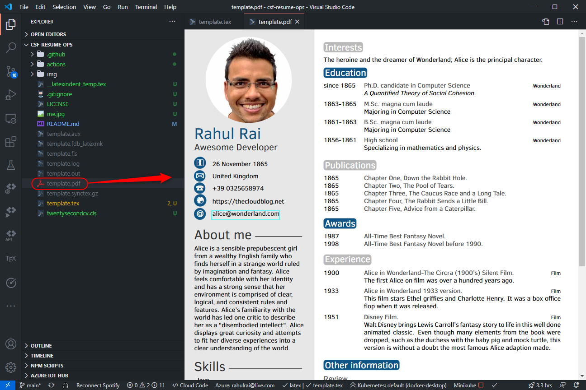
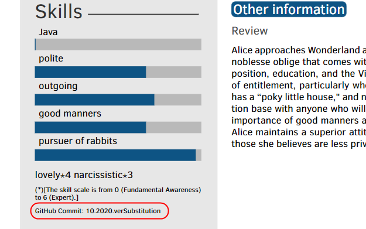
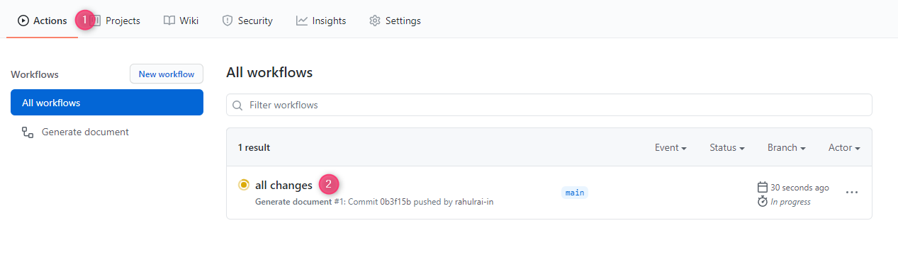
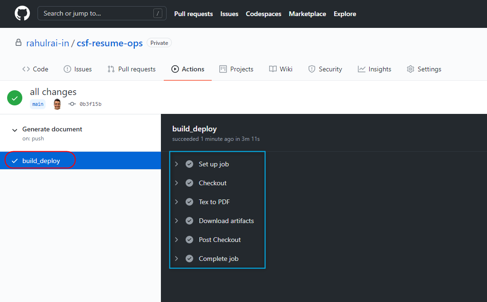
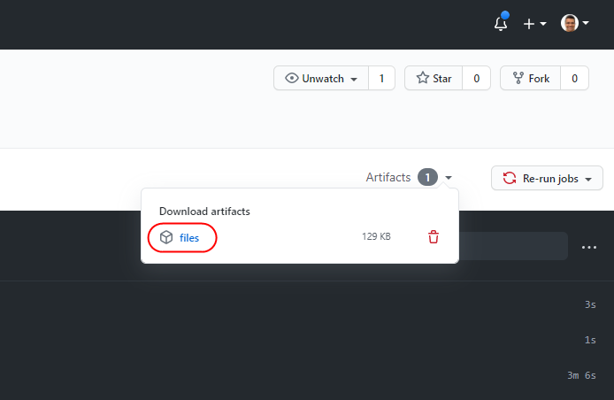
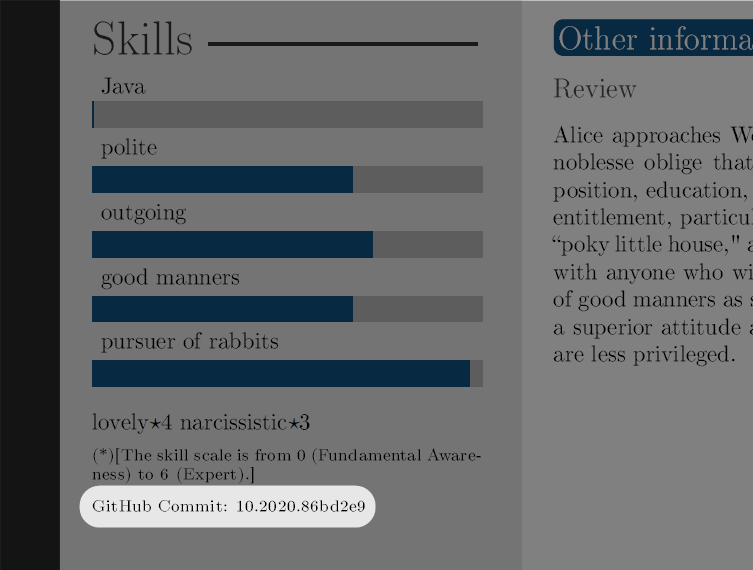

# DZone CSF: Enable Continuous Delivery of Your Résumé with GitHub Actions

> This article is my official entry to the DZone Computer Science Fair (CSF) 2020.

Here is my little secret: My résumé lives in a private GitHub repository. I use [TeX](https://www.tug.org/), which is a popular typesetting language, to compose my résumé. TeX helps you separate document text from formatting. Major publishers whose content and design teams work independently of each other use TeX. The content team produces content, and the design team makes the content presentable. In a typical publishing workflow, the author marks various content such as headers, footers with inbuilt or custom TeX commands. Subsequently, the designer works on the document's typesetting by adjusting the presentation aspect of the commands.

## TeX Primer

The predefined macros in TeX are quite limited. As an author, your manuscript might require fields such as footnotes and annotations, which are not available in TeX. [LaTeX](https://www.latex-project.org/) allows designers to extend the macros available to authors, which helps them focus on the content rather than formatting.

As an author, after writing a document using LaTeX, you require a LaTeX processor such as [LuaTex](http://www.luatex.org/), [XeTeX](http://tug.org/xetex/), and [pdfTeX](https://ctan.org/pkg/pdftex) to transform a TeX document to a PDF document. The various processors vary in their features, and therefore, you would need to find out which one produces optimal quality documents for your TeX files. I use XeTeX because it fits all my requirements.

All the popular TeX programs are generally packaged together, so you need not install each program individually. The [TeXLive](https://www.tug.org/texlive/) package includes binaries of the most popular TeX programs, macros, and fonts for all operating systems. Using the [LaTeX Workshop extension](https://marketplace.visualstudio.com/items?itemName=James-Yu.latex-workshop), you can get the best of TeXLive in VSCode.

## GitHub Actions

In a typical development workflow, GitHub stores the application code, and the CI\CD pipelines execute in an external service that integrates with GitHub using webhooks and personal access tokens. GitHub notifies the service of events such as push, and merge through webhooks, which kicks off the corresponding workflows in the service. GitHub has now patched this disconnect between your code and the DevOps services with a new feature named [GitHub Actions](https://github.com/features/actions/).

Actions are units of code that can execute when certain GitHub events occur, such as pushing a branch. Since this service lives within GitHub, you need not use another DevOps service and connect it to your GitHub repository. There are hundreds of actions available in the [GitHub marketplace](https://github.com/marketplace?type=actions), and this list is growing every day. You can also create custom Actions (we will build one), which are either Docker containers with your repository mounted as a volume to it or JavaScript code. Any discoverable Dockerfile or JavaScript script present either in your repository or a public repository can be used to build an action. To understand GH Actions in further detail, refer to the previous official documentation link.

## DevOps For Résumé

Although it was just a fun project for me, DevOpsifying your résumé makes sense because:

1. You get out of the box document versioning support.
2. The latest version of the document is always available to you on your favorite website (GitHub).
3. If someone (recruiter/client/company) asks you whether the document they have is the latest one, you only need to ask them one question (keep reading).
4. If you get to talk about it in an interview, you will stand out! 😎

I understand that there are alternatives such as CMS, saving content to cloud drives, etc. However, I prefer this approach, and any real developer who firmly believes in the [NIH philosophy](https://en.wikipedia.org/wiki/Not_invented_here) will too 😉 (an \* and some fine print here). Not just that, but by adding source control to your résumé, you can take advantage of features such as notes as commit messages for the changes that you made. The notes will help you remember the context behind recording something in your profile. For example, a simple statement such as "I improved the bug bounce rate from 20% to 10%" can carry the details in the commit message, such as what you did and why. You can look up the commits associated with any change with [`git blame` and `git log`](https://www.atlassian.com/git/tutorials/inspecting-a-repository/git-blame).

## Code

The source code for this sample is available on [my GitHub repository](https://github.com/rahulrai-in/csf-resume-ops).

I recommend that you use the source code as a guide while building your application with me.

## Step 1: Setup The Document Template

There are several LaTeX document templates available for free on the [latextemplates.com](https://www.latextemplates.com/) website. I am going to use the [Twenty Seconds Resume](https://www.latextemplates.com/template/twenty-seconds-resumecv) template for this demo. I recommend using the [LaTeX workshop VSCode Extension](https://github.com/James-Yu/LaTeX-Workshop/wiki) for local development and debugging.

Download the Zip file of the document template from the LaTeX template website. Next, create a [new GitHub repository](https://docs.github.com/en/free-pro-team@latest/github/getting-started-with-github/create-a-repo) and extract the contents of the template's zip file to your project folder.

Update the `template.tex` file with your details. As soon as you save the file, the LaTeX workshop extension will kick in and generate a PDF document from the Tex file as follows.



Make the template yours by adding your details in the appropriate sections of the document. We will automate the generation of the PDF document with a GitHub action rather than relying on the VSCode extension next.

## Step 2: Add Version Information

Before we go about setting up GitHub Actions, let's make a minor change to the template. We will insert a placeholder in the template for adding the version information so that we know whether the recipient has the latest copy of the document. To do so, add the following text to the `twentysecondcv.cls` file.

```sh
{GitHub Commit: \number \month .\number\year.verSubstitution}
```

The previous command adds the month number, the year number, and a string, `verSubstitution`, that we will substitute with the Git commit identifier through our GitHub Action later.

After adding the previous instruction to the `twentysecondcv.cls` file, you can view the version information in the generated document. Remember that the LaTeX VSCode extension generates PDF documents when you save the `.tex` files, so you must save the `template.tex` file for the document to be updated.



Now that our document is ready let's create a GitHub Action for its delivery.

## Step 3: Create GitHub Action

An [Action](https://docs.github.com/en/free-pro-team@latest/actions/creating-actions/about-actions) is an individual task in the DevOps workflow. There are several actions available on the GitHub marketplace, but you can define custom actions as per your requirements, which we will do next.

Create a folder named `actions` and a folder named `xelatex` inside it. An action can be either a Docker container specification or a JavaScript action. Since we need to compile our document with the [`xelatex` compiler](https://www.overleaf.com/learn/latex/XeLaTeX), we will create a Docker action.

The first step of creating a Docker action is to create a Dockerfile. Create a file named `Dockerfile` and add the following instructions to it.

```Dockerfile
FROM debian:latest

LABEL "maintainer"="Rahul Rai <rahul@rahul-rai.com>"
LABEL "repository"="https://github.com/rahulrai-in/csf-resume-ops"
LABEL "homepage"="https://github.com/rahulrai-in/csf-resume-ops"

LABEL "com.github.actions.name"="Convert to PDF"
LABEL "com.github.actions.description"="Convert documents to PDF using xelatex."
LABEL "com.github.actions.icon"="code"
LABEL "com.github.actions.color"="blue"

# Install all xelatex and LaTeX dependencies
RUN apt-get update && \
    apt-get install --yes --no-install-recommends \
    texlive-fonts-extra \
    texlive-fonts-recommended \
    texlive-generic-recommended \
    texlive-lang-english \
    texlive-xetex && \
    apt-get autoclean && apt-get --purge --yes autoremove && \
    rm -rf /var/lib/apt/lists/* /tmp/* /var/tmp/*

ADD entrypoint.sh /entrypoint.sh

RUN chmod +x /entrypoint.sh

ENTRYPOINT ["/entrypoint.sh"]
```

Apart from the optional `LABEL` instructions, you can see that we installed several `xelatex` dependencies, such as fonts and the language. After installing the dependencies, we invoke the script named `entrypoint.sh` which compiles the `.tex` documents and generates PDF documents from them.

Please create a new file named `entrypoint.sh` and add the following instructions to it.

```sh
#!/bin/bash

set -e

echo "Creating output directory $OUT_DIR..."
mkdir --parent $OUT_DIR

for fileName in *.tex *.cls; do
    [ -f "$fileName" ] || break

    echo "Substituting version number ${GITHUB_SHA::7} in file $fileName..."
    sed -i -e "s/verSubstitution/${GITHUB_SHA::7}/" $fileName
done

for fileName in *.tex; do
    [ -f "$fileName" ] || break

    echo "Converting file $fileName to pdf..."
    xelatex $fileName
done

cp *.pdf $OUT_DIR 2>/dev/null || :
```

Let's discuss what this script does. It first creates an output directory to store the generated PDF files. Next, it recursively goes through each `.tex` and `*.cls` file and replaces the string `verSubstitution` with the Git commit id. GitHub makes several environment variables available to the actions. For the full list of environment variables, refer to the [GitHub action documentation](https://docs.github.com/en/free-pro-team@latest/actions/reference/environment-variables). After text substitution, the script compiles each `.tex` document with the `xelatex` processor. The xelatex processor is the XeTeX typesetting engine for LaTeX. We installed XeTeX as part of TeX Live package in our Dockerfile.

Finally, the script copies all the generated PDF files to the output directory that it created earlier. The `cp` instruction can fail if it does not detect PDF files. Therefore, we made it direct stderr to a null device. This command will always report success. Probably not the best implementation, but it works.

## Step 4: Create a Workflow

A workflow in GitHub actions is a pipeline comprising a sequence of actions. To define a workflow, create a folder named `.github` and a file named `deploy.yaml`. Add the following specification to the file.

```yaml
name: "Generate document"
on:
  push:
    branches: [main]
defaults:
  run:
    working-directory: .
jobs:
  build_deploy:
    runs-on: ubuntu-latest
    steps:
      - name: Checkout
        uses: actions/checkout@v2

      - name: Tex to PDF
        uses: ./actions/xelatex
        env:
          OUT_DIR: public

      - name: Upload artifacts
        uses: actions/upload-artifact@v2
        with:
          name: files
          path: public/
```

Let's discuss the specification in detail. We first defined the workflow's name and specified the condition that this workflow should be executed when we push a commit to the `main` branch. Next, we specified the location of the artifacts and the actions by setting the root as the working directory of the workflow. Next, we defined a job, which is an aggregation of actions, and the type of VM required - Ubuntu. The job comprises three actions that would execute in sequence.

1. **Checkout**: It is a built-in action that downloads a copy of your repository.
2. **Tex to PDF**: This is our custom action that receives the copy of our repository from the previous action and converts the TeX documents to PDF. It stores the generated PDF documents in a folder named `public`.
3. **Upload artifacts**: This is another inbuilt action that takes the contents of a folder and uploads the contents of the folder as build artifacts in GitHub.

The following is the structure of a typical Action.

```plaintext
action "Name" {
  uses = "points to public or local repo or a docker instruction"
  needs = "array of actions this action depends on"
  args = "array or string of arguments"
  secrets = ["SECRET_NAME"]
  env = {
    ENV_VARIABLE_NAME = "ENV_VAR_NAME"
  }
}
```

Push the code in its current state to the main branch. Head over to the **Action** tab to view the pipeline in action.

## Showtime

In the **Actions** tab, click on the active workflow run as follows.



On the next screen, you can view the jobs and the actions that are part of the job executing sequentially.



You can expand the actions to view the logs generated by them during execution. Remember that the last action uploads the autogenerated PDF documents as artifacts generated from the workflow. Download the artifacts by clicking on the **Artifacts** button.



Inside the artifacts folder, you will find your document fresh off the DevOps pipeline. Let's verify the version information in the document.



Let us discuss the advantage of versioning your résumé. If a recruiter/interviewer wants to verify whether the copy they have is the latest one, you can ask them the version information that they see in the document. Just knowing the month and the year is sufficient most of the time, but with the commit SHA, you can also track the exact commit that generated the copy.

## Conclusion

I love the DevOps model that GitHub adopted with Actions. There is no need to host the Action images yourself as the runtime builds them on the fly. This feature ensures that you need not connect your GitHub repository to systems outside the GitHub ecosystem, such as DockerHub. Co-locating the code with DevOps (and much more) is now a fascinating feature of GitHub.
